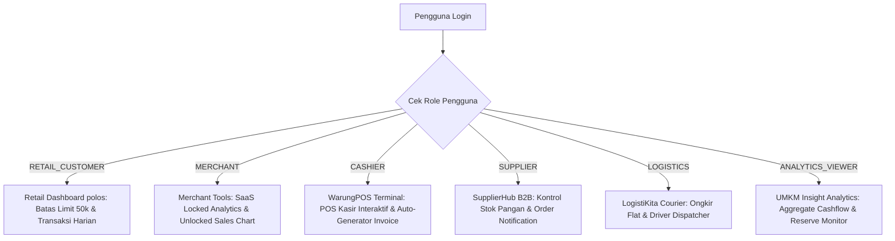

# 📊 Laporan Progres Proyek: SmartBank Wallet
**Status Proyek:** Fase 5 - Integrasi Fitur Finansial Premium & Auditing (Selesai Sepenuhnya)  
**Tingkat Pembekalan:** Model Produksi Nyata Realistis (RPL 2)  
**Teknologi:** Node.js, Express.js, Vanilla JS (SPA), Vanilla CSS (Premium Matte Light Mode)

Dokumen ini merangkum seluruh pencapaian, fitur terimplementasi, struktur arsitektur, dan langkah integrasi lanjutan untuk sistem retail Tier-2 **SmartBank Wallet**.

---

## 🏗️ 1. Ikhtisar Pencapaian Proyek

Proyek ini telah berhasil menyelesaikan seluruh dasar arsitektur model **Two-Tier CBDC** simulatif yang realistis sesuai dengan model perbankan komersial nyata. Pengguna mendaftar secara default sebagai nasabah biasa, dan dapat mengajukan tingkat upgrade bisnis untuk membuka fitur-fitur ekosistem lainnya secara dinamis.

### 🌟 Fitur Utama yang Telah Selesai:
1.  **Transformasi Visual Premium Light Mode:**
    *   Mengadopsi tema *Light Mode* perbankan digital modern yang bersih, kontras, dan futuristik.
    *   **Platinum Silver Card Theme:** Kartu utama dengan gradasi perak metalik premium kontras tinggi, lengkap dengan *specular glow* dan chip mikroelektronika emas yang menawan.
    *   **Aksesibilitas Tombol:** Tombol dengan font warna putih bersih (`#ffffff`) kontras tinggi di atas latar belakang solid.
2.  **Alur Peningkatan Peran Akun Bisnis Realistis (Model Upgrade Produksi):**
    *   Pendaftaran akun baru secara otomatis default sebagai akun Retail User biasa selaiknya bank komersial/e-wallet asli.
    *   Modul upgrade akun bisnis disematkan langsung di dalam panel **PENGATURAN AKUN** di bawah tab **Upgrade Bisnis**.
    *   Status KYC pengguna bisnis bertransformasi menjadi **`VERIFIED`**, badge dasbor terupdate, dan panel widgets ekosistem yang relevan dengan peran baru langsung dirender secara interaktif!
3.  **Dasbor Ekosistem Dinamis (Role-Based Ecosystem Panel):**
    *   Dasbor kiri bawah dilengkapi dengan panel dinamis `#role-ecosystem-panel` yang merender widget khusus secara interaktif tergantung peran aktif pengguna.
4.  **Matriks Kompliance compliance & Limits (Baru):**
    *   **Limit Nominal KYC-Based:** Membatasi nominal transaksi Rp 50.000 untuk Retail BASIC, dan otomatis melonggar menjadi Rp 1.000.000 untuk VERIFIED Business Account.
    *   **Progress Bar Jumlah Transaksi:** Visual progress bar harian (maksimal 10 transaksi) yang berubah warna menjadi jingga/merah saat mendekati batas limit harian.
5.  **Velocity Cooldown Visualizer (Baru):**
    *   Pengamanan moneter (Velocity of Money) dengan mengaktifkan jeda cooldown **10 detik** setelah transaksi finansial settled.
    *   Tombol transaksi di modal P2P & tagihan langsung terdisable secara dinamis dengan visual hitung mundur detik interaktif (`Jeda Keamanan (X s)...`).
6.  **Double-Entry Ledger Audit Trail (Baru):**
    *   Clickable mutasi rekening yang membuka area jurnal Debit & Kredit sistemik secara balance (Total Debits == Total Credits) sekelas akunting profesional.
7.  **SaaS Premium Analytics Subscription (Baru):**
    *   Membatasi widget analitik penjualan Merchant dengan tabir premium locked glassmorphism seharga **Rp 10.000**.
    *   Dinamis meng-unlock panel analitik real-time net/gross sales lengkap dengan grafik batang progresif begitu pembayaran subscription settled.
8.  **Progres Kredit UMKM (Baru):**
    *   Visual progress bar rasio cicilan pinjaman terbayar vs total tagihan `(paidAmount / totalDue) * 100` lengkap dengan indikator sisa tagihan terupdate.

---

## 🛠️ 2. Detail Fungsionalitas Modul Ekosistem (Dynamic Widgets)

Berdasarkan peran pengguna saat login atau sesudah di-upgrade, antarmuka dasbor akan secara dinamis menyajikan fungsionalitas berikut:

*   **POS Kasir Terminal (`CASHIER`):** Operator dapat menginput nama item dan harga, men-generate invoice tagihan PENDING sesungguhnya di memori Central Bank, membuka Pay Modal, dan menaruh ID tagihan otomatis untuk langsung dibayar.
*   **Alat Merchant UMKM (`MERCHANT`):** Analitik pendapatan kotor, bersih, potongan pajak (2%), dan platform fee di-lock seharga Rp 10.000. Saat di-unlock, menampilkan grafik batang mikro analitik pendapatan modern.
*   **SupplierHub B2B (`SUPPLIER`):** Modul kontrol stok bahan baku pangan (Beras Sak, Minyak Pail, Gula Karung) dan notifikasi pesanan masuk dari UMKM.
*   **LogistiKita Kurir (`LOGISTICS`):** Alat estimasi ongkos kirim flat LogistiKita dan dispatcher notifikasi driver logistik terintegrasi.
*   **UMKM Insight (`ANALYTICS_VIEWER`):** Grafik agregat read-only untuk memantau peredaran uang, velocity, volume transaksi, dan cadangan (*reserve*) Bank Sentral.

---

## 📁 3. Arsitektur File Terimplementasi

Seluruh logika fintech diatur dalam struktur direktori modular yang bersih:

*   **`src/app.js`**: Pintu masuk routing utama, CORS, static server, dan global error handler.
*   **`src/server.js`**: Menjalankan listener server di port 3000.
*   **`src/config/`**:
    *   `config.js`: Membaca konfigurasi environment variables (`.env`).
    *   `database.js`: Mengatur koneksi PostgreSQL pool dan High-fidelity In-Memory Fallback Engine.
*   **`src/middleware/`**:
    *   `auth.middleware.js`: Memvalidasi token JWT Bearer.
    *   `pin.middleware.js`: Memvalidasi PIN transaksi finansial sebelum settlement.
    *   `idempotency.middleware.js`: Menolak request ganda menggunakan *Idempotency-Key* guna mencegah double spending.
*   **`src/services/`**:
    *   `auth.service.js`: Mengurus pendaftaran dan login.
    *   `centralBank.service.js`: Mesin simulasi core moneter (saldo, ledger, loan, topup, withdrawal, stimulus, subscribeInsight).
    *   `token.service.js`: Mengemas payload user dan enkripsi JWT.
*   **`src/public/`**:
    *   `index.html`: Struktur HTML dasbor dan modal pembayaran.
    *   `style.css`: Desain Matte Light Mode premium, dropdown select, ledger tables, locked widgets, sales micro-charts, dan progress bar.
    *   `app.js`: Pengendali event click, form submissions, review estimasi biaya, render dynamic widgets, generateLedgerHTML, handleCooldownTimer, dan subscribeMerchantInsight.

---

## 📈 4. Parameter Finansial & Aturan Keuangan Terintegrasi

Sistem mematuhi aturan keuangan ekosistem secara presisi dengan pembulatan ke bawah (*floor*) berbasis **Basis Points (BPS)**:

*   **Total Money Supply:** Rp 1.000.000.000 (Maksimum)
*   **Bank Reserve:** $\ge$ 98% (Min Rp 980.000.000)
*   **Saldo Awal Akun Baru:** Rp 50.000
*   **Kecepatan Transaksi:** 10 Transaksi/User/Hari, Cooldown jeda 10 detik.
*   **Matriks Pemotongan Biaya (Fees & Taxes):**
    *   *Pajak Sistem:* 2% (`TAX_SINK` account)
    *   *Bank Fee:* 1% (`FEE_BANK` account)
    *   *Gateway Fee:* 0.5% (`FEE_GATEWAY` account)
    *   *Marketplace Fee:* 2% (`FEE_MARKETPLACE` account)
    *   *POS Fee:* 1% (`FEE_POS` account)
    *   *Langganan Insight:* Rp 10.000 (`wal_system_reserve` sink)

---

## 🔮 5. Langkah Kerja & Integrasi Lanjutan (Next Steps)

Karena tier *Core Bank* dikerjakan oleh rekan tim Anda, wallet ini dirancang agar **sangat mudah beralih ke integrasi real** saat Core Bank selesai:

1.  **Matikan Opsi Mock Core:**
    *   Saat API Core Bank rekan Anda siap, buka file konfigurasi `.env` pada wallet.
    *   Ubah variabel `CENTRAL_BANK_MOCK=true` menjadi `false`.
    *   Ubah `CENTRAL_BANK_URL` ke alamat server Core Bank rekan Anda (misalnya `http://localhost:4000`).
2.  **Peralihan Otomatis API:**
    *   Seluruh *service* di `centralBank.service.js` telah dilengkapi logika *switching* otomatis. Jika `mock` diset `false`, sistem langsung mengalihkan pemanggilan *In-Memory* ke pemanggilan HTTP API real menggunakan `fetch()` ke rute endpoint yang disepakati (misal: `POST /api/v1/cb/transfers`).
3.  **Pengujian End-to-End Tim:**
    *   Melakukan registrasi user baru di Wallet -> Verifikasi data masuk di server PostgreSQL Core Bank.
    *   Melakukan upgrade akun bisnis di Wallet -> Verifikasi data role berubah di database pusat.
